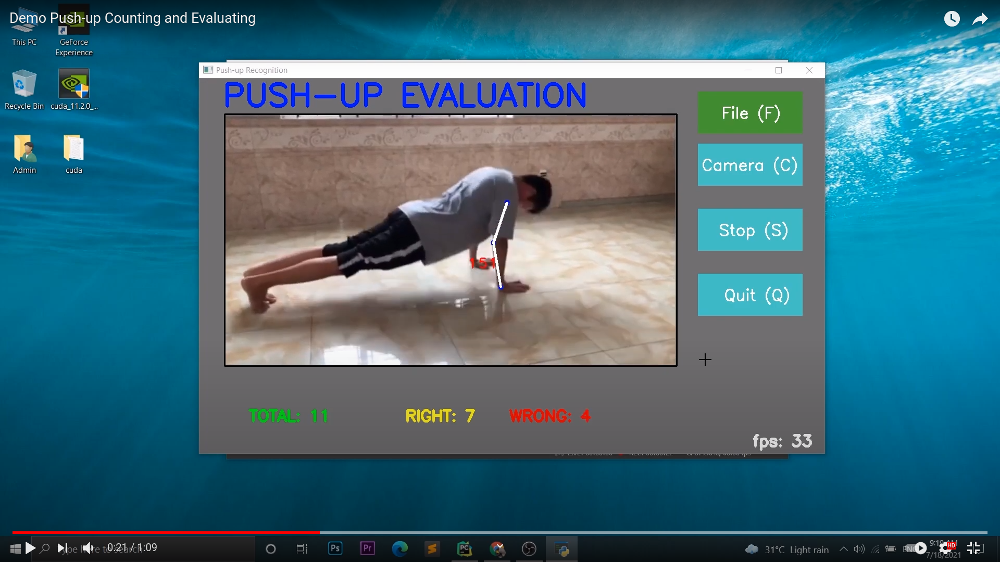

# Pushup Counting and Evaluating
An application using Deep Learning and Diginal Signal Processing to both count the repetitions of a person doing pushup exercise and evaluate whether that person had done the pushup in correct or incorrect form.  

<a href="https://www.youtube.com/watch?v=JnRxwmSixk0&ab_channel=thinh5"></a>

## 1. Install requirements  
To run this, Python 3.7 or later need to be installed on your local machine, along with these dependencies:  
- OpenCV
- Mediapipe
- Numpy
- Keras
- Matplotlib
  
You can install all using the requirements file:
```
pip install -r requirements.txt
```
## 2. Download pretrained models
1. Download pretrained models at [here](https://drive.google.com/drive/folders/1nKQMMo74NAo1TxBvTUw_DXn5L4eoLqwl) and replace the existed models file in `/models` (if none are in `/models`, just place the downloaded models in) 
3. Adjust the config.json file to the following:
  
Replace
- `model up file`: the model_up file you downloaded (up1.h5)
- `model down file`: the model_down file you downloaded (down1.h5)

## 3. Demo
  
Run demo app by:  
```
python pushup_app.py
```
